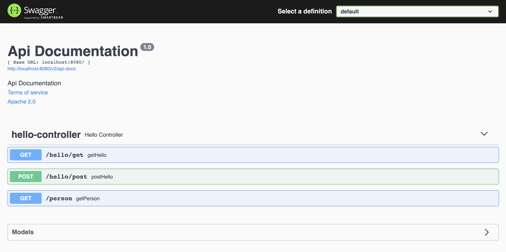

# spring-boot-webflux-swagger-starter
> An example project to illustrate how to document Spring Boot Webflux with Swagger2

## Requirements

- Java 11

## Installation

```bash
git clone https://github.com/pgilad/spring-boot-webflux-swagger-starter.git
```

## Usage

```bash
gradle bootRun
```

Now open your favorite web-browser (Chrome) to `http://localhost:8080/swagger-ui.html` which is automatically
generated from the `HelloController` web-flux mapping.



## License

MIT